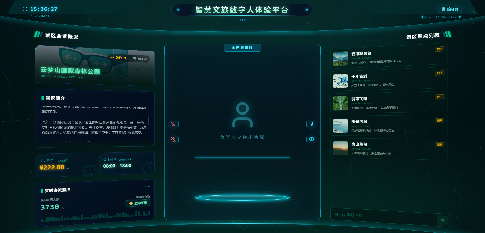
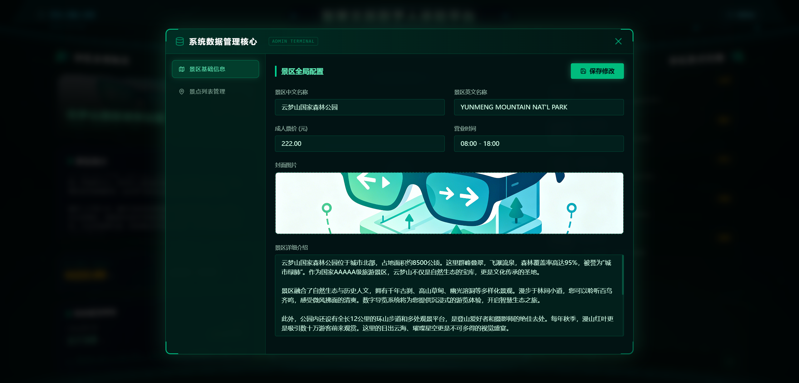

<div align="center">
  <h1>智慧文旅数字人体验平台 (Scenic Digital)</h1>
  <p>
    <a href="https://vuejs.org/"></a>
    <a href="https://vitejs.dev/"></a>
    <a href="https://pinia.vuejs.org/"></a>
    <a href="https://flask.palletsprojects.com/"></a>
    <a href="https://www.mysql.com/"></a>
  </p>
  <p>
    <a href="https://gitee.com/fay-community/scenic-digital/stargazers"></a>
    <a href="https://gitee.com/fay-community/scenic-digital/members"></a>
    <a href="LICENSE"></a>
  </p>
</div>

智慧文旅数字人体验平台是一个基于 **Vue 3 + Pinia + Flask + MySQL** 构建的现代化、科幻风格的大屏展示与管理平台。该项目以 Fay 数字人服务和魔珐星云 3D 渲染 SDK 为核心，提供沉浸式的景区全景概览、实时客流监控、景点本地图片上传管理以及与 3D 伴游向导互动的综合性解决方案。

非常适合用于：**企业展厅展示、景区游客中心大屏、政府数字化投标演示**以及**全栈开发学习参考**。

---

## 📺 项目展示


*平台主界面（数字向导未唤醒状态）*


*平台主界面（全息展示舱与 3D 伴游数字人）*


*沉浸式系统数据管理控制台（支持本地图片上传）*

---

## 🔥 核心特性

- 🎨 **极致的科幻 UI 设计与组件化架构**
  - 采用 Tailwind CSS v4 构建深色科幻风格（Cyberpunk/Tech风格）。
  - 大屏拆分为清晰的左中右三面板布局（LeftPanel / CenterPanel / RightPanel）。
  - 包含复杂的 CSS 几何裁剪（Clip-path）、3D 翻转错落对齐、粒子特效与光晕发光渲染。
- 📊 **实时客流与舒适度联动计算**
  - 后端动态基于各景点实时在园人数与最大承载量计算拥挤度（畅通/适中/拥挤）。
  - 前端基于 Pinia 进行全局状态管理，一处修改，大屏多面板实时联动刷新。
- 🤖 **深度集成魔珐星云与 Fay 数字人**
  - 预留中央全息展示舱，对接魔珐星云（XmovAvatar）Web 3D 渲染 SDK。
  - 支持通过控制台一键启动/关闭 Fay 核心大脑服务和前端 3D 渲染引擎，并能进行麦克风收音控制和伴游向导语音播报。
- ⚙️ **所见即所得的数据管理后台与本地上传**
  - 内置全局居中覆盖的科幻风格 `AdminOverlay` 数据控制台。
  - 支持直接在浏览器拖拽/点击上传本地图片，Flask 后端自动生成 UUID 并提供本地静态文件服务。
  - 支持景点列表的完整 CRUD（增删改查）和景区全局基础信息修改。
- 🏗 **标准化的全栈工程架构**
  - **前端**：Vue 3 组合式 API, Pinia 全局状态, Axios 拦截器封装, `@` 路径别名配置, 环境变量隔离。
  - **后端**：Python Flask 蓝图路由分发, Service 业务逻辑层抽离, `.env` 敏感配置隔离。
- 🗺️ **MCP 地图导航服务**
  - 基于 Model Context Protocol (MCP) 协议构建独立的地图导航服务。
  - 集成高德地图 API，支持景区内任意两点之间的步行路线规划。
  - 数字人可直接调用导航工具，为游客提供语音导航指引。

---

## 🛠 技术栈

### 前端 (Frontend)
- **核心框架**: Vue 3 (Composition API)
- **状态管理**: Pinia
- **构建工具**: Vite
- **样式方案**: Tailwind CSS v4
- **网络请求**: Axios
- **图标库**: Lucide Vue Next

### 后端 (Backend)
- **核心框架**: Python Flask
- **架构模式**: 蓝图 (Blueprints) 路由分发 + Service 业务逻辑层
- **环境隔离**: python-dotenv
- **跨域处理**: Flask-CORS
- **文件处理**: Werkzeug (本地安全文件上传)
- **数据库驱动**: PyMySQL

### MCP 服务 (MCP Server)
- **核心框架**: FastMCP (Model Context Protocol)
- **地图服务**: 高德地图 Web API
- **功能**: 景区内步行导航路线规划

### 数据库 (Database)
- **MySQL 8.0+** (提供完整的建表与测试数据 SQL 脚本)

---

## 🚀 快速开始

### 1. 启动 Fay 服务 (前提条件)
本项目依赖 Fay 数字人作为核心大脑服务，请先下载并运行 Fay：
- **下载运行 Fay 安装包**: [百度网盘链接](https://pan.baidu.com/s/1J-W9PZQEMA49wXrWT1wOpA?pwd=kxca) (提取码: `kxca`)
- **公共配置 config_center**（不稳定，建议更换成个人的）：`f87f8984-716e-41ea-ad86-6d9452e77256`

### 2. 数据库准备
1. 确保已安装并运行 MySQL 服务。
2. 创建数据库并导入初始化脚本：
   ```bash
   mysql -u root -p < database/scenic_init.sql
   ```

### 3. 环境变量配置
在启动之前，请确保分别配置好前端和后端的环境变量：

**后端配置 (`backend/.env`)**：
1. 进入 `backend` 目录，复制模板文件：
   ```bash
   cp .env.example .env
   ```
2. 修改 `.env` 中的数据库连接密码 `DB_PASSWORD` 及其他信息。

**前端配置 (`.env`)**：
1. 在项目根目录，复制模板文件：
   ```bash
   cp .env.example .env
   ```
2. 填入您的魔珐星云数字人 `VITE_XMOV_APP_ID` 和 `VITE_XMOV_APP_SECRET`。
   > **注**：Xmov SDK 凭证的获取请进入官网 `https://c.c1nd.cn/9C9WW` 邀请码：`JHTA3EQSZP`，注册后可免费试用。

**MCP 服务配置 (`mcp_server/.env`)**：
1. 进入 `mcp_server` 目录，复制模板文件：
   ```bash
   cp .env.example .env
   ```
2. 填入高德地图 Web 服务 API Key：
   - `AMAP_KEY`: 您的高德地图 Web 服务 API Key
   > **获取方式**：访问 [高德开放平台](https://lbs.amap.com/) 注册账号，创建应用后获取 Web 服务 API Key。

### 4. 启动项目

**方式一：一键启动脚本（推荐）**

我们为您提供了方便的一键启动脚本，它会自动检测并安装前后端依赖，并同时启动两个服务：

- **Windows 用户**:
  直接双击根目录 `scripts` 文件夹下的 `start.bat`，或者在命令行执行：
  ```cmd
  .\scripts\start.bat
  ```

- **Mac / Linux 用户**:
  在终端执行：
  ```bash
  bash scripts/start.sh
  ```

**方式二：手动启动（适用于调试）**

**步骤1：启动后端服务**

```bash
# 进入后端目录
cd backend

# 创建Python虚拟环境（首次运行）
python -m venv venv

# 激活虚拟环境
# Windows:
venv\Scripts\activate
# macOS/Linux:
source venv/bin/activate

# 安装依赖（首次运行）
pip install -r requirements.txt

# 启动后端服务
python run.py
```

**步骤2：启动前端服务**

打开新的终端窗口：

```bash
# 安装前端依赖（首次运行）
npm install

# 启动前端服务 (默认端口5173)
npm run dev
```

**步骤3：访问应用**

- 前端大屏展示: `http://localhost:5173`
- 后端 API 服务: `http://localhost:5000`

---

## 📁 核心目录结构

```text
├── backend/                   # Python Flask 后端目录
│   ├── app/                   # 后端核心代码 (routes, services, utils)
│   ├── uploads/               # 本地图片上传存储目录
│   ├── .env.example           # 后端数据库环境变量模板
│   └── run.py                 # 后端启动入口
├── mcp_server/                # MCP 地图导航服务目录
│   ├── main.py                # MCP 服务入口 (高德地图导航)
│   ├── requirements.txt       # MCP 服务依赖
│   └── .env.example           # 高德地图 API Key 配置模板
├── database/                  # 数据库目录
│   └── scenic_init.sql        # MySQL 初始化脚本 (包含建表与 Mock 数据)
├── scripts/                   # 项目自动化脚本
│   ├── start.bat              # Windows 一键启动脚本
│   └── start.sh               # Linux/Mac 一键启动脚本
├── src/                       # Vue 3 前端源码
│   ├── api/                   # Axios 请求封装
│   ├── components/            # 拆分的 Vue UI 组件 (LeftPanel, CenterPanel, RightPanel)
│   ├── stores/                # Pinia 状态管理 (scenic.js, avatar.js)
│   ├── pages/                 # 页面级组件 (ScenicScreen.vue)
│   ├── utils/                 # 前端工具类 (全局 Message 提示等)
│   └── main.js                # Vue 挂载入口
├── .env.example               # 前端环境变量模板 (API BaseUrl, SDK Key)
├── jsconfig.json              # IDE 路径智能提示配置 (@ 指向 src)
└── vite.config.js             # Vite 构建配置
```

---

## 🗺️ MCP 地图导航服务

本项目集成了基于 **Model Context Protocol (MCP)** 协议的地图导航服务，为数字人提供智能导航能力。

### 功能特性
- **步行路线规划**：支持景区内任意两点之间的步行导航
- **智能位置识别**：支持"当前位置"等语义化关键词
- **自然语言输出**：返回人类可读的导航指令和预计时间

### 配置说明
1. 获取高德地图 Web 服务 API Key：访问 [高德开放平台](https://lbs.amap.com/)
2. 在 `mcp_server/.env` 中配置 `AMAP_KEY`
3. Fay 数字人会自动通过 MCP 协议调用导航工具

### 使用示例
游客可以询问数字人：
- "从这里到千年古刹怎么走？"
- "当前位置到云海观景台有多远？"

---

## 🤝 参与贡献

欢迎提交 Issue 和 Pull Request 来完善这个项目！
如果是重大变更，请先开一个 Issue 讨论您想要改变的内容。

## 📄 开源协议

本项目采用 [MIT License](LICENSE) 开源协议 - 详情请查看 LICENSE 文件。
